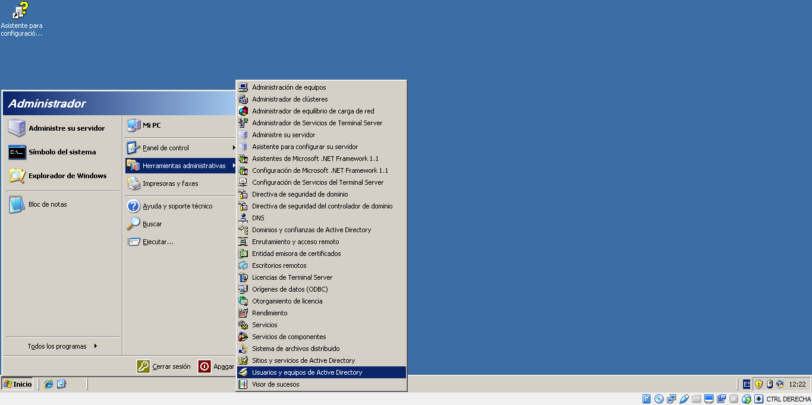
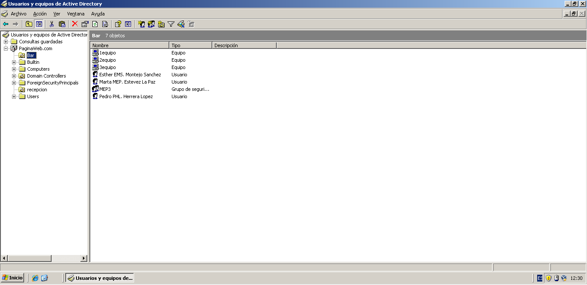
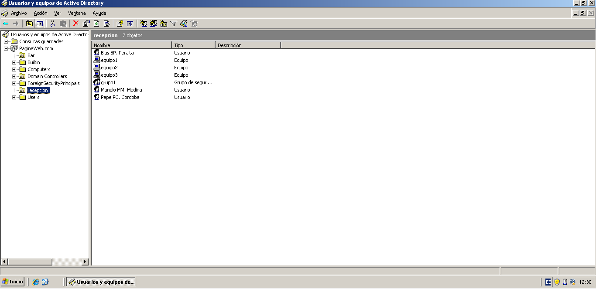
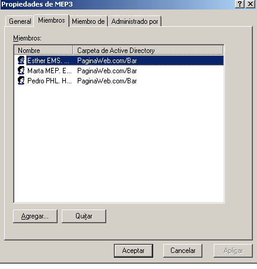
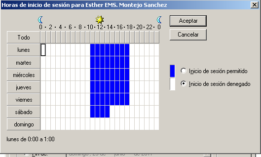
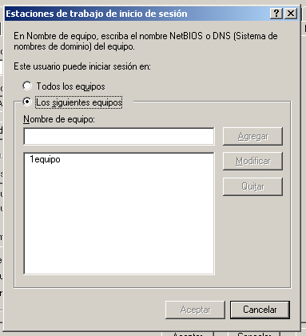

# WindowsServer
Crearemos empresa (hotel) con dos unidades organizativas (bar y recepcion).

El bar constará de un grupo (MEP3) formado por tres usuarios los cuales tienen un horario definido y con acceso a un unico equipo asociado por cada persona.

Asi mismo la recepcion constará de otro grupo (grupo1) formado igualmente por otros tres usuarios con un horario definido y acceso a un equipo personal.

Para realizar la empresa deberemos seguir los siguientes pasos:

1.- Instalaremos el DCPROMO.EXE

2.- Haremos el siguiente paso

3.- Crearemos las dos unidades organizativas (bar y recepcion). Creamos los usuarios y los equipos asi como el grupo.

4.- Añadimos los respectivos miembros al grupo

5.- Asignamos los horarios a cada usuario, asi como el equipo al que van a tener acceso

6.- FIN
